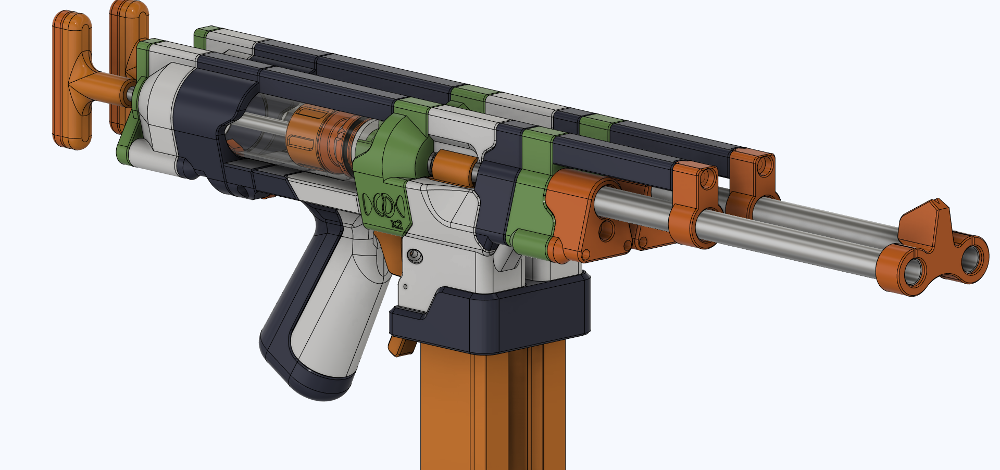

# DoubleSkewer
The Twoer, a doubled up side-by-side Skewer variant.

This is the 'Twoer', a doubled up Skewer. Inspired by the Second Degree Burn double Caliburn, this is two Skewers in one shell, side by side.

**You need two Skewer hardware kits to make one Twoer**

The triggers are separate for easily firing one side at a time. The priming handles are available separated or combined. There is also files included to add picatinny rail to the front sight and right above the magazines. 

There are two versions of front sight, 1 and 2. 1 only allows you to put the sight on the tip of barrels, while 2 allows you to put the sight at any point on a barrel, like the midpoint of super long barrels.

All STLs were exported in print orientation. STEP and F3D are also provided.

## Misc.

**If you wish to print and sell this item, please contact me for licensing. I can be reached on Discord (Sillybutts#5905), Reddit (u/SillyTheGamer), or by Thingiverse comments. We will also need to talk to Taffy.**

 This work is licensed under a <a rel="license" href="http://creativecommons.org/licenses/by-nc-sa/4.0/">Creative Commons Attribution-NonCommercial-ShareAlike 4.0 International License</a>.

## Images

